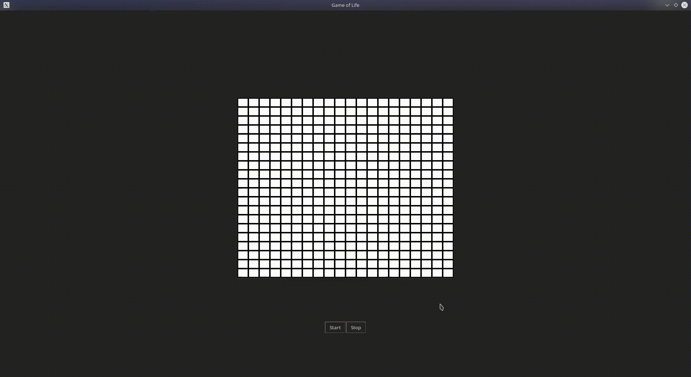

# Game of Life

This is a GUI implementation of Game of Life using only python's standard library.

Tested on Ubuntu LTS 20.04 - Python 3.8.5

## Structure
* config.ini
    This file has some basic UI configurations.
    * CELL_WIDTH : The width of each cell
    * CELL_HEIGHT: The height of each cell. Having width as 3 and * height as 1, gives a nice ratio visually.
    * NUM_OF_ROWS: No of cells in each row
    * NUM_OF_COLS: No of cells in each cols. Increasing NUM_OF_ROWS and NUM_OF_COLS makes rendering slow and also since there is no scroll whole thing might not be visible.
* game_of_life.py
    This is the main file having game program
* tests
    This folder has all the test cases
    * test_methods.py - Unit tests for each method of game logic
    * test_configurations.py - Some tests for basic shape progressions in Game of Life

## Running the game

```bash
python3 game_of_life.py
```

## Testing the game

```bash
python3 -m unittest tests/*.py
```

## Demo
